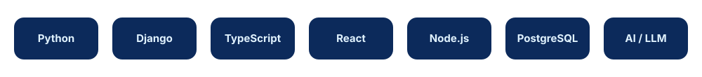

## 👋 درباره تمهید

**تمهید (Tamhid)** یک تیم کوچک و چابک توسعه نرم‌افزار است.
ما با استانداردهای روشن و فرآیندهای سبک، محصولاتی می‌سازیم که **ساده، قابل اتکا و قابل نگهداری** باشند.

- 🌐 **توسعه وب** — Backend و Frontend مدرن
- ⚙️ **اتوماسیون** — حذف کارهای تکراری با ابزار و اسکریپت
- 🤖 **هوش مصنوعی** — راهکارهای مبتنی بر LLM و یادگیری ماشین

## 🛠️ استک فنی

## 📚 ریپوهای شرکت

| ریپو | توضیح |
|---|---|
| 🏢 [**company**](https://github.com/tamhid-company/company) | هویت شرکت، تیم، فرآیندها و استانداردها |
| 📦 [**projects-docs**](https://github.com/tamhid-company/projects-docs) | مستندات هر پروژه |
| ⚙️ [**.github**](https://github.com/tamhid-company/.github) | تمپلیت‌های Issue / PR و CODEOWNERS |

## 📊 آمار

## 📬 ارتباط

 

